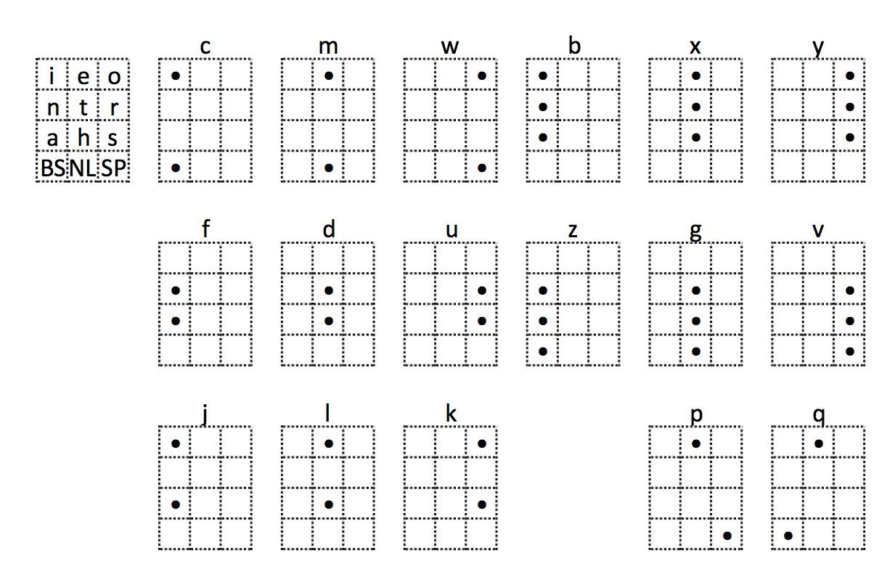

# Cool Hand
a [Twiddler 3](http://twiddler.tekgear.com/index.html) chord map optimized for the UNIX command-line   
designed for [vim](http://www.vim.org/about.php)/[bash](https://en.wikipedia.org/wiki/Bash_(Unix_shell))/[mutt](http://www.mutt.org/)/[irssi](https://irssi.org/)  

*dedicated to the legendary parmaster*

# Summary
This is a beginner-friendly Twiddler chord map. It is accompanied with a suite of configuration files for the UNIX command-line. The maps are displayed with the keys facing away from you (same as *Finger Editor in Reverse Mode* in [Twiddler Tuner](http://twiddler.tekgear.com/tuner/)).

# Design
This chord map combines ideas from [TabSpace](http://rhodesmill.org/brandon/projects/tabspace-guide.pdf), [BackSpice](http://forum.tekgear.com/t/backspice-layout-config-fw-0-09/45), [MirrorWalk](http://forum.tekgear.com/t/on-the-walking-layout/195) and [Dial with Fingers](http://forum.tekgear.com/t/dial-with-fingers/317).

It is a good beginner's layout. It uses symmetry to facilitate learning.  The chords are designed to be completed by hitting all the buttons simultaneously in one crisp motion.

### Observations
- **Not all chords are created equal**  
*Take a good look at your hand. Now make a fist while curling each finger slowly with as little effort as possible. Notice the asymmetrical curve your fingertips form.*  
While [`R00M`](http://twiddler.tekgear.com/doc/doku.php?id=chordnotation) is easily chordable, its mirror chord `L00M` requires significant effort.

- **Adjacent fingers pull/push each other during movement**  
For the RETURN key, it is more satisfying to chord `LMM0` than `LM00` even though the former uses more buttons. 

- **Chords performed by striking all buttons at the same time are faster**  
Than walking the chord, holding down one button at a time. 

- **Fast chording/typing is a subconscious activity**  
With practice, the learning gets progressively pushed towards lower layers of the motor cortex. In other words, it is coded in the muscles instead of conscious memory.

- **[Multi-Character Chords](http://twiddler.tekgear.com/doc/doku.php?id=tuner_advanced)(MMC) increase cognitive load**  
MMCs are tantalizing because they promise to deliver speed improvement. Excessive use of bi/trigrams requires conscious context-switches. Fingers are [faster](http://www.goodreads.com/book/show/7873438-sleights-of-mind) than your attention.

### Design Principles

- use symmetry to facilitate learning
- prefer chords with keys on the same column
- reduce adjacent fingers on different columns
- prefer [comfortable](http://ivanwfr.github.io/Twiddler3-Layout/#div_twiddler3_fingers_agility) 3-4 button chords over difficult 2 button chords
- prefer chords that balance/stabilize a free rolling Twiddler in the palm 
*(I use the Twiddler strapless)*
- prefer MMC that approximate the chord configuration of its first character
- for N-grams, prefer comfort over mnemonic
- prefer individual characters over MMCs  
  
  
Tested on Twiddler 3 running firmware 0.15u  
  
*"grins like a baby but bites like a [gator](http://forum.tekgear.com/t/cool-hand-a-beginner-friendly-chord-map/335)"*  

